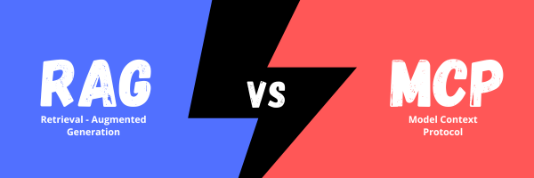

<div align="center">



<!-- # MCP vs RAG -->

<h2>A unified research framework for comparing RAG and MCP approaches in question-answering systems</h2>

[](https://www.python.org/)
[](https://github.com/langchain-ai/langgraph)
[](https://qdrant.tech/)
[](LICENSE)

---

</div>

## Overview

This project implements a unified LangGraph workflow with **parallel RAG and MCP branches** that execute simultaneously and merge their results into a **single JSON output** for direct comparison.

### Key Features

| Feature | Description |
|---------|-------------|
| **Parallel Execution** | RAG and MCP run simultaneously using `asyncio.gather()` |
| **Context Isolation** | Each approach maintains its own context (never mixed) |
| **Unified Output** | Single JSON file per configuration with both results |
| **Independent Evaluation** | RAGAS metrics calculated separately for each approach |
| **Fair Comparison** | Same prompt, model, and execution conditions |

### Architecture

```
                    User Prompt
                         │
          ┌──────────────┴──────────────┐
          ↓                             ↓
    RAG Branch                     MCP Branch
    (Retrieve → Generate → Eval)   (Search → Generate → Eval)
          ↓                             ↓
          └──────────────┬──────────────┘
                         ↓
                  Merge Results
                         ↓
              Single Unified JSON
              (Contains both RAG and MCP results)
```

---

## Project Structure

```
mcp-vs-rag/
├── config/
│   └── docker-compose.yml      # Qdrant configuration
├── src/
│   ├── rag/                    # RAG implementations (Naive & Hybrid)
│   ├── mcp/                    # MCP client for tool integration
│   ├── models/                 # LLM factory (GPT-5, Gemini 2.5 Pro)
│   ├── evaluation/             # RAGAS evaluator
│   └── workflow/               # LangGraph workflow orchestration
├── data/
│   ├── knowledge_base/         # RAG data (chunks, embeddings, originals)
│   └── outputs/                # Experiment results (JSON files)
├── requirements.txt
├── .env.example
├── run_experiment.py           # Main experiment runner
├── README.md                   # This file
└── copilot-instructions.md     # Development guide
```

---

## Quick Start

### 1. Install Dependencies

```bash
pip install -r requirements.txt
```

### 2. Configure Environment

```bash
cp .env.example .env
```

Edit `.env` with your API keys:
- `OPENAI_API_KEY` — for GPT-5
- `GOOGLE_API_KEY` — for Gemini 2.5 Pro
- `TAVILY_API_KEY` — for Tavily MCP tool

### 3. Start Qdrant Database

```bash
cd config
docker-compose up -d
```

### 4. Run Experiments

```bash
python run_experiment.py
```

This executes the experiment with **ALL questions** from the ground truth dataset, running **8 configurations** for each question:

| Models | RAG Types | MCP Tools |
|--------|-----------|-----------|
| GPT-5 (OpenAI) | Naive | Tavily |
| Gemini 2.5 Pro (Google) | Hybrid | DuckDuckGo |

#### Command Line Options

| Command | Description |
|---------|-------------|
| `python run_experiment.py` | Run with ALL questions (default) |
| `python run_experiment.py 5` | Run with 5 random questions |
| `python run_experiment.py 1` | Run with 1 random question |

Results are saved to `data/outputs/` as two main JSON files.

---

## Output Files

When running experiments with multiple questions, the system generates **only two main files**:

| File | Description |
|------|-------------|
| `experiment_summary.json` | Complete experiment summary with all results from all questions and configurations |
| `consolidated_analysis.json` | Global comparative analysis across ALL questions with metrics grouped by model, RAG type, MCP server, and question-by-question performance |

---

## Output Format

Each experiment produces a **unified JSON file** containing both RAG and MCP results:

<details>
<summary>View JSON Structure</summary>

```json
{
  "execution_id": "uuid",
  "timestamp": "2025-11-03T10:30:00",
  "configuration": {
    "model": "gpt-5",
    "rag_type": "naive",
    "mcp_server": "tavily"
  },
  "prompt": "What are the latest AI developments?",
  
  "rag_results": {
    "retrieved_context": ["Context from Qdrant..."],
    "generated_answer": "Based on knowledge base...",
    "ragas_metrics": {
      "answer_relevancy": 0.87,
      "faithfulness": 0.92
    }
  },
  
  "mcp_results": {
    "retrieved_context": ["Web search from Tavily..."],
    "generated_answer": "Based on web sources...",
    "ragas_metrics": {
      "answer_relevancy": 0.82,
      "faithfulness": 0.89
    }
  }
}
```

</details>

---

## Configuration

### Experiment Configurations

The system runs 8 combinations defined in `run_experiment.py`:

<details>
<summary>View Configurations</summary>

```python
CONFIGURATIONS = [
    {"model": "gpt-5", "rag_type": "naive", "mcp_server": "tavily"},
    {"model": "gpt-5", "rag_type": "naive", "mcp_server": "duckduckgo"},
    {"model": "gpt-5", "rag_type": "hybrid", "mcp_server": "tavily"},
    {"model": "gpt-5", "rag_type": "hybrid", "mcp_server": "duckduckgo"},
    {"model": "gemini-2.5-pro", "rag_type": "naive", "mcp_server": "tavily"},
    {"model": "gemini-2.5-pro", "rag_type": "naive", "mcp_server": "duckduckgo"},
    {"model": "gemini-2.5-pro", "rag_type": "hybrid", "mcp_server": "tavily"},
    {"model": "gemini-2.5-pro", "rag_type": "hybrid", "mcp_server": "duckduckgo"},
]
```

</details>

### Customization

Modify `run_experiment.py` to:
- Change test prompts
- Add/remove configurations
- Adjust output formats
- Modify evaluation metrics

---

## Technology Stack

| Category | Technology |
|----------|------------|
| **Orchestration** | LangGraph (parallel workflow execution) |
| **Vector Database** | Qdrant (Docker) |
| **MCP Tools** | Tavily & DuckDuckGo (web search) |
| **Evaluation** | RAGAS (Answer Relevancy + Faithfulness) |
| **LLM Models** | GPT-5 (OpenAI), Gemini 2.5 Pro (Google) |
| **Language** | Python 3.8+ |

---

## Analysis & Comparison

After running experiments, you can analyze:

| Analysis Type | Questions to Answer |
|---------------|---------------------|
| **RAG vs MCP Performance** | Which approach has better relevancy/faithfulness scores? |
| **Model Comparison** | Does GPT-5 or Gemini 2.5 Pro perform better? |
| **RAG Strategy Evaluation** | Does Hybrid RAG outperform Naive RAG? |
| **MCP Tool Selection** | Does Tavily or DuckDuckGo provide better context? |

---

## Development

For detailed development instructions, see [`copilot-instructions.md`](copilot-instructions.md).

### Code Entry Point

```python
from src.workflow.main_workflow import execute_unified_workflow

result = await execute_unified_workflow(
    prompt="Your question here",
    model_name="gpt-5",
    rag_type="naive",
    mcp_server="tavily"
)
```

### Running Tests

<details>
<summary>View Test Example</summary>

```bash
python -c "
import asyncio
from src.workflow.main_workflow import execute_unified_workflow

async def test():
    result = await execute_unified_workflow(
        prompt='What is quantum computing?',
        model_name='gpt-5',
        rag_type='naive',
        mcp_server='tavily'
    )
    print(result)

asyncio.run(test())
"
```

</details>

---

## Requirements

| Requirement | Details |
|-------------|---------|
| **Python** | 3.8+ |
| **Docker** | For Qdrant |
| **API Keys** | OpenAI, Google, Tavily |

### MCP Servers

```bash
# Tavily
docker run -i --rm -e TAVILY_API_KEY mcp/tavily

# DuckDuckGo
docker run -i --rm mcp/duckduckgo
```

---

## Contributing

1. Fork the repository
2. Create a feature branch
3. Make your changes
4. Test thoroughly
5. Submit a pull request

---

## License

[MIT License](LICENSE)

---

<div align="center">

**[Report Bug](../../issues) · [Request Feature](../../issues)**

</div>
