<div align="center">

# 🔬 MCP vs RAG Comparison Project

### Advanced Research Framework for AI-Powered Question Answering Systems

[](https://www.python.org/downloads/)
[](LICENSE)
[](https://www.langchain.com/)
[](https://langchain-ai.github.io/langgraph/)
[](https://qdrant.tech/)
[](https://docs.ragas.io/)

*A cutting-edge research project comparing static retrieval (RAG - Retrieval Augmented Generation) with dynamic web search (MCP - Model Context Protocol) for question-answering systems using parallel execution and unified evaluation.*

[Features](#-key-features) • [Quick Start](#-quick-start) • [Architecture](#-architecture) • [Configuration](#-configuration) • [Documentation](#-documentation)

</div>

---

## 📑 Table of Contents

- [🎯 Overview](#-overview)
- [✨ Key Features](#-key-features)
- [🏗️ Architecture](#️-architecture)
- [📋 Project Structure](#-project-structure)
- [🚀 Quick Start](#-quick-start)
- [📊 Output Format](#-output-format)
- [🔧 Configuration](#-configuration)
- [🧪 Technology Stack](#-technology-stack)
- [📈 Analysis & Comparison](#-analysis--comparison)
- [🛠️ Development](#️-development)
- [📋 Requirements](#-requirements)
- [🤝 Contributing](#-contributing)
- [📄 License](#-license)
- [🙋 Support](#-support)

## 🎯 Overview

This project implements a **unified LangGraph workflow** with parallel RAG and MCP branches that execute simultaneously and merge their results into a single JSON output for direct comparison.

> **Why This Matters:** Understanding the trade-offs between static knowledge bases (RAG) and dynamic web search (MCP) is crucial for building effective AI systems. This framework provides objective metrics to guide architectural decisions.

## ✨ Key Features

<table>
<tr>
<td width="50%">

### 🚀 Performance
- **Parallel Execution**: RAG and MCP run simultaneously using `asyncio.gather()`
- **Fast Processing**: Reduced execution time through concurrent operations
- **Scalable Architecture**: Easily add new models or evaluation metrics

</td>
<td width="50%">

### 🎯 Accuracy
- **Context Isolation**: Each approach maintains its own context (never mixed)
- **Independent Evaluation**: RAGAS metrics calculated separately
- **Fair Comparison**: Same prompt, model, and execution conditions

</td>
</tr>
<tr>
<td width="50%">

### 📊 Output
- **Unified JSON**: Single file per configuration with both results
- **Comprehensive Metrics**: Answer relevancy and faithfulness scores
- **Structured Data**: Easy to parse and analyze programmatically

</td>
<td width="50%">

### 🔧 Flexibility
- **Multiple Models**: GPT-5, Gemini 2.5 Pro support
- **Multiple RAG Types**: Naive and Hybrid implementations
- **Multiple MCP Tools**: Tavily and DuckDuckGo integration

</td>
</tr>
</table>

## 🏗️ Architecture

The system implements a sophisticated parallel execution model using LangGraph, ensuring fair comparison between RAG and MCP approaches.

### Execution Flow

```mermaid
graph TB
    A[👤 User Prompt] --> B[🔄 Initialize State]
    B --> C{Parallel Execution}
    
    C -->|Branch 1| D[📚 RAG Pipeline]
    C -->|Branch 2| E[🌐 MCP Pipeline]
    
    D --> D1[🔍 Retrieve from Qdrant]
    D1 --> D2[🤖 Generate Answer<br/>Using RAG Context]
    D2 --> D3[📊 RAGAS Evaluation]
    
    E --> E1[🔎 Web Search<br/>Tavily/DuckDuckGo]
    E1 --> E2[🤖 Generate Answer<br/>Using MCP Context]
    E2 --> E3[📊 RAGAS Evaluation]
    
    D3 --> F[🔗 Merge Results]
    E3 --> F
    
    F --> G[💾 Single Unified JSON<br/>Contains Both Results]
    
    style A fill:#e1f5ff
    style B fill:#fff4e1
    style C fill:#ffe1e1
    style D fill:#e1ffe1
    style E fill:#f0e1ff
    style F fill:#ffe1f0
    style G fill:#fff9e1
    style D3 fill:#c8ffc8
    style E3 fill:#e8c8ff
```



### Key Architecture Principles

```mermaid
graph LR
    subgraph Parallel["⚡ Parallel Execution"]
        A1[asyncio.gather]
        A2[No Sequential Waiting]
        A3[Independent Branches]
    end
    
    subgraph Isolation["🔒 Context Isolation"]
        B1[RAG: Qdrant Only]
        B2[MCP: Web Only]
        B3[Never Mixed]
    end
    
    subgraph Output["📦 Unified Output"]
        C1[Single JSON File]
        C2[Side-by-Side Results]
        C3[Easy Comparison]
    end
    
    subgraph Eval["📊 Independent Evaluation"]
        D1[Separate RAGAS Metrics]
        D2[Fair Assessment]
        D3[Objective Comparison]
    end
    
    style Parallel fill:#e1f5ff
    style Isolation fill:#ffe1e1
    style Output fill:#e1ffe1
    style Eval fill:#fff4e1
```



## 📋 Project Structure

```mermaid
graph TD
    Root[🗂️ mcp-vs-rag/] --> Config[📁 config/]
    Root --> Src[📁 src/]
    Root --> Data[📁 data/]
    Root --> Files[📄 Files]
    
    Config --> DC[docker-compose.yml<br/>🐳 Qdrant Config]
    
    Src --> RAG[📚 rag/<br/>Naive & Hybrid]
    Src --> MCP[🌐 mcp/<br/>Tool Integration]
    Src --> Models[🤖 models/<br/>LLM Factory]
    Src --> Eval[📊 evaluation/<br/>RAGAS]
    Src --> Work[⚙️ workflow/<br/>LangGraph]
    
    Data --> KB[📖 knowledge_base/<br/>Chunks & Embeddings]
    Data --> Out[💾 outputs/<br/>JSON Results]
    
    Files --> Req[requirements.txt<br/>📦 Dependencies]
    Files --> Env[.env.example<br/>🔑 Config Template]
    Files --> Run[run_experiment.py<br/>▶️ Main Runner]
    Files --> RM[README.md<br/>📘 Documentation]
    
    style Root fill:#e1f5ff
    style Config fill:#fff4e1
    style Src fill:#ffe1e1
    style Data fill:#e1ffe1
    style Files fill:#f0e1ff
```



### Directory Details

<details>
<summary>📁 <b>config/</b> - Infrastructure Configuration</summary>

- `docker-compose.yml` - Qdrant vector database setup
- Easy one-command deployment for dependencies

</details>

<details>
<summary>📁 <b>src/</b> - Core Application Code</summary>

| Directory | Purpose | Key Components |
|-----------|---------|----------------|
| `rag/` | RAG implementations | Naive RAG, Hybrid RAG, retrieval logic |
| `mcp/` | MCP integration | Tavily client, DuckDuckGo client, tool adapters |
| `models/` | LLM providers | GPT-5 factory, Gemini 2.5 Pro factory |
| `evaluation/` | Metrics calculation | RAGAS evaluator, metric aggregation |
| `workflow/` | Orchestration | LangGraph state management, parallel execution |

</details>

<details>
<summary>📁 <b>data/</b> - Data Storage</summary>

- `knowledge_base/` - RAG source data (document chunks, embeddings, original files)
- `outputs/` - Experiment results (unified JSON files with metrics)

</details>

<details>
<summary>📄 <b>Root Files</b></summary>

- `run_experiment.py` - Main experiment orchestrator (8 configurations)
- `requirements.txt` - Python dependencies
- `.env.example` - Environment variable template
- `README.md` - Project documentation (this file)
- `ARCHITECTURE.md` - Detailed technical architecture

</details>

## 🚀 Quick Start

Get up and running in less than 5 minutes!

### Prerequisites

Before you begin, ensure you have:
- 🐍 Python 3.8 or higher
- 🐳 Docker and Docker Compose
- 🔑 API Keys (see step 2)

### Installation Steps

#### 1️⃣ Install Dependencies

```bash
# Clone the repository (if not already done)
git clone https://github.com/JhonHander/mcp-vs-rag.git
cd mcp-vs-rag

# Install Python packages
pip install -r requirements.txt
```

#### 2️⃣ Configure Environment Variables

```bash
# Copy the example environment file
cp .env.example .env

# Edit .env and add your API keys:
# OPENAI_API_KEY=your_openai_key_here        # For GPT-5
# GOOGLE_API_KEY=your_google_key_here        # For Gemini 2.5 Pro
# TAVILY_API_KEY=your_tavily_key_here        # For web search
```

> 💡 **Getting API Keys:**
> - OpenAI: https://platform.openai.com/api-keys
> - Google AI: https://makersuite.google.com/app/apikey
> - Tavily: https://tavily.com/

#### 3️⃣ Start Qdrant Vector Database

```bash
cd config
docker-compose up -d

# Verify Qdrant is running
docker ps | grep qdrant
```

#### 4️⃣ Run Experiments

```bash
# Return to project root
cd ..

# Execute all 8 configurations
python run_experiment.py
```

### 🎉 What Happens Next?

The system will execute **8 parallel comparisons**:

| Configuration | Model | RAG Type | MCP Tool |
|--------------|-------|----------|----------|
| Config 1 | GPT-5 | Naive | Tavily |
| Config 2 | GPT-5 | Naive | DuckDuckGo |
| Config 3 | GPT-5 | Hybrid | Tavily |
| Config 4 | GPT-5 | Hybrid | DuckDuckGo |
| Config 5 | Gemini 2.5 Pro | Naive | Tavily |
| Config 6 | Gemini 2.5 Pro | Naive | DuckDuckGo |
| Config 7 | Gemini 2.5 Pro | Hybrid | Tavily |
| Config 8 | Gemini 2.5 Pro | Hybrid | DuckDuckGo |

Results are saved to `data/outputs/` as unified JSON files with complete metrics for both RAG and MCP approaches.

## 📊 Output Format

Each experiment produces a **unified JSON file** containing both RAG and MCP results for direct comparison.

### Unified JSON Structure

```json
{
  "execution_id": "uuid-4a3b2c1d",
  "timestamp": "2025-11-03T10:30:00Z",
  "configuration": {
    "model": "gpt-5",
    "rag_type": "naive",
    "mcp_server": "tavily"
  },
  "prompt": "What are the latest AI developments?",
  
  "rag_results": {
    "retrieved_context": [
      "Context chunk 1 from Qdrant vector database...",
      "Context chunk 2 from Qdrant vector database..."
    ],
    "generated_answer": "Based on the knowledge base, recent AI developments include...",
    "ragas_metrics": {
      "answer_relevancy": 0.87,
      "faithfulness": 0.92,
      "context_precision": 0.85,
      "context_recall": 0.88
    }
  },
  
  "mcp_results": {
    "retrieved_context": [
      "Web search result 1 from Tavily...",
      "Web search result 2 from Tavily..."
    ],
    "generated_answer": "Based on recent web sources, AI developments show...",
    "ragas_metrics": {
      "answer_relevancy": 0.82,
      "faithfulness": 0.89,
      "context_precision": 0.80,
      "context_recall": 0.85
    }
  }
}
```

### Output Metrics Explained

| Metric | Range | Description |
|--------|-------|-------------|
| **Answer Relevancy** | 0-1 | How well the answer addresses the question |
| **Faithfulness** | 0-1 | How accurately the answer reflects the context |
| **Context Precision** | 0-1 | Quality of retrieved context items |
| **Context Recall** | 0-1 | Completeness of retrieved context |

> 📈 **Higher scores are better** - Values closer to 1.0 indicate superior performance

### File Naming Convention

Files are automatically named to reflect their complete configuration:

```
{model}_{rag_type}_{mcp_server}_{config_number}.json
```

**Examples:**
- `gpt5_naive_tavily_1.json` - GPT-5 with Naive RAG and Tavily search
- `gpt5_hybrid_duckduckgo_4.json` - GPT-5 with Hybrid RAG and DuckDuckGo
- `gemini25pro_naive_tavily_5.json` - Gemini 2.5 Pro with Naive RAG and Tavily
- `gemini25pro_hybrid_duckduckgo_8.json` - Gemini 2.5 Pro with Hybrid RAG and DuckDuckGo

### Output Location

All results are stored in:
```
data/outputs/
```

Each file represents one complete experiment with both RAG and MCP results included.

## 🔧 Configuration

### Experiment Configurations

The system runs **8 predefined combinations** defined in `run_experiment.py`:

```python
CONFIGURATIONS = [
    {"model": "gpt-5", "rag_type": "naive", "mcp_server": "tavily"},
    {"model": "gpt-5", "rag_type": "naive", "mcp_server": "duckduckgo"},
    {"model": "gpt-5", "rag_type": "hybrid", "mcp_server": "tavily"},
    {"model": "gpt-5", "rag_type": "hybrid", "mcp_server": "duckduckgo"},
    {"model": "gemini-2.5-pro", "rag_type": "naive", "mcp_server": "tavily"},
    {"model": "gemini-2.5-pro", "rag_type": "naive", "mcp_server": "duckduckgo"},
    {"model": "gemini-2.5-pro", "rag_type": "hybrid", "mcp_server": "tavily"},
    {"model": "gemini-2.5-pro", "rag_type": "hybrid", "mcp_server": "duckduckgo"},
]
```

### Configuration Parameters

<table>
<tr>
<th>Parameter</th>
<th>Options</th>
<th>Description</th>
</tr>
<tr>
<td><code>model</code></td>
<td>
• <code>gpt-5</code><br/>
• <code>gemini-2.5-pro</code>
</td>
<td>LLM provider for answer generation</td>
</tr>
<tr>
<td><code>rag_type</code></td>
<td>
• <code>naive</code><br/>
• <code>hybrid</code>
</td>
<td>RAG retrieval strategy:<br/>
<b>Naive</b>: Basic vector similarity<br/>
<b>Hybrid</b>: Vector + keyword search</td>
</tr>
<tr>
<td><code>mcp_server</code></td>
<td>
• <code>tavily</code><br/>
• <code>duckduckgo</code>
</td>
<td>Web search tool for MCP branch</td>
</tr>
</table>

### Customization Options

You can customize the experiment by modifying `run_experiment.py`:

<details>
<summary>🔄 Change Test Prompts</summary>

```python
# Modify the test questions
prompts = [
    "What are the latest AI developments?",
    "Explain quantum computing applications",
    "Compare machine learning frameworks"
]
```

</details>

<details>
<summary">➕ Add/Remove Configurations</summary>

```python
# Add a new configuration
CONFIGURATIONS.append({
    "model": "claude-3",
    "rag_type": "naive", 
    "mcp_server": "tavily"
})

# Or filter configurations
filtered_configs = [c for c in CONFIGURATIONS if c["model"] == "gpt-5"]
```

</details>

<details>
<summary>📊 Adjust Evaluation Metrics</summary>

```python
# In src/evaluation/ragas_evaluator.py
# Add custom metrics or modify scoring weights
metrics = {
    "answer_relevancy": custom_relevancy_scorer,
    "faithfulness": custom_faithfulness_scorer,
    "custom_metric": your_custom_metric
}
```

</details>

<details>
<summary>💾 Modify Output Formats</summary>

```python
# Change output format in run_experiment.py
output_format = {
    "include_timestamps": True,
    "include_raw_context": False,
    "format": "json"  # or "csv", "parquet"
}
```

</details>

## 🧪 Technology Stack

### Core Technologies

```mermaid
graph LR
    subgraph Frontend["🎨 User Interface"]
        A[Python CLI]
    end
    
    subgraph Orchestration["⚙️ Orchestration"]
        B1[LangGraph]
        B2[LangChain]
        B3[asyncio]
    end
    
    subgraph LLMs["🤖 Language Models"]
        C1[GPT-5<br/>OpenAI]
        C2[Gemini 2.5 Pro<br/>Google]
    end
    
    subgraph Data["💾 Data Layer"]
        D1[Qdrant<br/>Vector DB]
        D2[JSON<br/>Results]
    end
    
    subgraph Tools["🔧 External Tools"]
        E1[Tavily<br/>Web Search]
        E2[DuckDuckGo<br/>Web Search]
    end
    
    subgraph Eval["📊 Evaluation"]
        F[RAGAS<br/>Metrics]
    end
    
    A --> B1
    B1 --> B2
    B2 --> C1
    B2 --> C2
    B1 --> D1
    B1 --> E1
    B1 --> E2
    B1 --> F
    F --> D2
    
    style Frontend fill:#e1f5ff
    style Orchestration fill:#ffe1e1
    style LLMs fill:#e1ffe1
    style Data fill:#fff4e1
    style Tools fill:#f0e1ff
    style Eval fill:#ffe1f0
```



### Technology Details

| Component | Technology | Version | Purpose |
|-----------|-----------|---------|---------|
| **Orchestration** | LangGraph | 0.2+ | Parallel workflow execution & state management |
| | LangChain | 0.2+ | LLM abstraction & tool integration |
| | asyncio | Built-in | Concurrent task execution |
| **Vector Database** | Qdrant | 1.8+ | Document embeddings storage (Docker) |
| **LLM Models** | GPT-5 | Latest | OpenAI's advanced language model |
| | Gemini 2.5 Pro | Latest | Google's multimodal AI model |
| **MCP Tools** | Tavily | Latest | AI-optimized web search API |
| | DuckDuckGo | Latest | Privacy-focused web search |
| **Evaluation** | RAGAS | 0.1+ | Answer Relevancy & Faithfulness metrics |
| **Data Processing** | FastEmbed | Latest | Fast embedding generation |
| **Environment** | Python | 3.8+ | Programming language runtime |
| **Containers** | Docker | Latest | Qdrant & MCP server deployment |

### Key Dependencies

```python
# Core LangChain Stack
langchain>=0.2.0
langgraph>=0.2.0
langchain-core>=0.2.0
langchain-mcp-adapters>=0.1.0

# LLM Providers
langchain-openai>=0.1.0
langchain-google-genai>=1.0.0

# Vector Database
qdrant-client>=1.8.0
langchain-qdrant>=0.1.0

# Evaluation
ragas>=0.1.0
datasets>=2.14.0

# Utilities
python-dotenv>=1.0.0
pydantic>=2.0.0
fastembed
```

## 📈 Analysis & Comparison

After running experiments, you can perform comprehensive analysis across multiple dimensions.

### Analysis Dimensions


### Key Research Questions

<table>
<tr>
<th width="30%">Dimension</th>
<th>Research Questions</th>
</tr>
<tr>
<td>

### 1️⃣ RAG vs MCP Performance

</td>
<td>

- ❓ Which approach achieves higher **answer relevancy** scores?
- ❓ Which demonstrates better **faithfulness** to source material?
- ❓ Does performance vary by **model** or **RAG type**?
- ❓ When should you choose **static knowledge** vs **dynamic web search**?

**Key Metrics:** Compare `rag_results.ragas_metrics` vs `mcp_results.ragas_metrics`

</td>
</tr>
<tr>
<td>

### 2️⃣ Model Comparison

</td>
<td>

- ❓ Does **GPT-5** or **Gemini 2.5 Pro** perform better overall?
- ❓ Are performance differences **consistent** across RAG/MCP branches?
- ❓ Which model handles **complex queries** more effectively?
- ❓ What are the **cost-performance trade-offs**?

**Analysis:** Filter results by model and aggregate metrics

</td>
</tr>
<tr>
<td>

### 3️⃣ RAG Strategy Evaluation

</td>
<td>

- ❓ Does **Hybrid RAG** outperform **Naive RAG**?
- ❓ Is the increased **complexity** justified by improvements?
- ❓ Which strategy works better for different **question types**?
- ❓ What's the impact on **retrieval precision**?

**Comparison:** Compare metrics where `rag_type` differs but other params match

</td>
</tr>
<tr>
<td>

### 4️⃣ MCP Tool Selection

</td>
<td>

- ❓ Does **Tavily** or **DuckDuckGo** provide better context quality?
- ❓ Which tool integrates more effectively with each **LLM model**?
- ❓ How do the tools compare on **recency** and **coverage**?
- ❓ What are the **API cost implications**?

**Method:** Compare MCP results where only `mcp_server` varies

</td>
</tr>
</table>

### Sample Analysis Workflow

```python
import json
import pandas as pd
from pathlib import Path

# Load all results
results_dir = Path("data/outputs")
results = [json.load(open(f)) for f in results_dir.glob("*.json")]

# Create analysis dataframe
df = pd.DataFrame([{
    'model': r['configuration']['model'],
    'rag_type': r['configuration']['rag_type'],
    'mcp_server': r['configuration']['mcp_server'],
    'rag_relevancy': r['rag_results']['ragas_metrics']['answer_relevancy'],
    'mcp_relevancy': r['mcp_results']['ragas_metrics']['answer_relevancy'],
    'rag_faithfulness': r['rag_results']['ragas_metrics']['faithfulness'],
    'mcp_faithfulness': r['mcp_results']['ragas_metrics']['faithfulness']
} for r in results])

# Compare RAG vs MCP
print("Average RAG Relevancy:", df['rag_relevancy'].mean())
print("Average MCP Relevancy:", df['mcp_relevancy'].mean())

# Model comparison
print("\nBy Model:")
print(df.groupby('model')[['rag_relevancy', 'mcp_relevancy']].mean())

# RAG type comparison
print("\nBy RAG Type:")
print(df.groupby('rag_type')[['rag_relevancy', 'rag_faithfulness']].mean())
```

### Visualization Ideas


## 🛠️ Development

### Code Entry Point

The main workflow can be invoked programmatically:

```python
from src.workflow.main_workflow import execute_unified_workflow
import asyncio

async def main():
    result = await execute_unified_workflow(
        prompt="Your question here",
        model_name="gpt-5",
        rag_type="naive",
        mcp_server="tavily"
    )
    return result

# Run the workflow
result = asyncio.run(main())
```

### Running Individual Components

<details>
<summary>🧪 Test RAG Only</summary>

```python
from src.rag.naive_rag import NaiveRAG
from src.models.llm_factory import create_llm

# Initialize components
rag = NaiveRAG(qdrant_url="http://localhost:6333")
llm = create_llm("gpt-5")

# Test retrieval
contexts = await rag.retrieve("What is machine learning?")
print("Retrieved contexts:", contexts)

# Generate answer
answer = await llm.generate(contexts, "What is machine learning?")
print("Answer:", answer)
```

</details>

<details>
<summary>🌐 Test MCP Only</summary>

```python
from src.mcp.tavily_client import TavilyClient
from src.models.llm_factory import create_llm

# Initialize components
mcp = TavilyClient()
llm = create_llm("gemini-2.5-pro")

# Test web search
results = await mcp.search("Latest AI news 2025")
print("Search results:", results)

# Generate answer
answer = await llm.generate(results, "What's new in AI?")
print("Answer:", answer)
```

</details>

<details>
<summary>📊 Test Evaluation</summary>

```python
from src.evaluation.ragas_evaluator import RAGASEvaluator

evaluator = RAGASEvaluator()

metrics = await evaluator.evaluate(
    question="What is quantum computing?",
    answer="Quantum computing uses quantum mechanics...",
    contexts=["Context 1...", "Context 2..."]
)

print("Metrics:", metrics)
```

</details>

### Running Tests

```bash
# Run specific configuration test
python -c "
import asyncio
from src.workflow.main_workflow import execute_unified_workflow

async def test():
    result = await execute_unified_workflow(
        prompt='What is quantum computing?',
        model_name='gpt-5',
        rag_type='naive',
        mcp_server='tavily'
    )
    print(result)

asyncio.run(test())
"

# Run pytest (if tests are configured)
pytest tests/

# Run with coverage
pytest --cov=src tests/
```

### Development Workflow

```mermaid
graph LR
    A[📝 Write Code] --> B[🧪 Unit Test]
    B --> C[🔧 Integration Test]
    C --> D[📊 Run Experiment]
    D --> E{Results OK?}
    E -->|Yes| F[✅ Commit]
    E -->|No| A
    F --> G[📤 Push]
    
    style A fill:#e1f5ff
    style B fill:#ffe1e1
    style C fill:#ffe1e1
    style D fill:#fff4e1
    style E fill:#f0e1ff
    style F fill:#e1ffe1
    style G fill:#e1ffe1
```



### Code Style & Best Practices

- ✅ Follow **PEP 8** style guidelines
- ✅ Use **type hints** for all function parameters
- ✅ Write **docstrings** for public APIs
- ✅ Keep functions **small and focused**
- ✅ Use **async/await** for I/O operations
- ✅ Handle **exceptions** gracefully
- ✅ Log important events for debugging

### Debugging Tips

```bash
# Enable debug logging
export LOG_LEVEL=DEBUG

# Run with verbose output
python run_experiment.py --verbose

# Check Qdrant status
curl http://localhost:6333/collections

# View MCP tool logs
docker logs mcp-tavily

# Inspect workflow state
python -m pdb run_experiment.py
```

For detailed development instructions, see [`ARCHITECTURE.md`](ARCHITECTURE.md).

## 📋 Requirements

### System Requirements

| Component | Requirement | Notes |
|-----------|-------------|-------|
| **Python** | 3.8 or higher | Tested with 3.8, 3.9, 3.10, 3.11, 3.12 |
| **Docker** | Latest version | For Qdrant vector database |
| **Docker Compose** | Latest version | For container orchestration |
| **Memory** | 4GB+ RAM | For vector embeddings |
| **Storage** | 2GB+ free | For data and outputs |

### API Keys Required

```bash
# OpenAI (for GPT-5)
OPENAI_API_KEY=sk-...
# Get: https://platform.openai.com/api-keys

# Google AI (for Gemini 2.5 Pro)
GOOGLE_API_KEY=AIza...
# Get: https://makersuite.google.com/app/apikey

# Tavily (for web search)
TAVILY_API_KEY=tvly-...
# Get: https://tavily.com/
```

### Optional MCP Servers

If you want to run MCP tools in Docker (alternative to API-based):

```bash
# Tavily MCP Server
docker run -i --rm \
  -e TAVILY_API_KEY=your_key \
  mcp/tavily

# DuckDuckGo MCP Server (no API key needed)
docker run -i --rm mcp/duckduckgo
```

### Python Package Dependencies

All dependencies are listed in `requirements.txt`:

```txt
langchain>=0.2.0
langgraph>=0.2.0
langchain-openai>=0.1.0
langchain-google-genai>=1.0.0
qdrant-client>=1.8.0
ragas>=0.1.0
python-dotenv>=1.0.0
pydantic>=2.0.0
```

Install all at once:
```bash
pip install -r requirements.txt
```

## 🤝 Contributing

We welcome contributions from the community! Here's how you can help:

### How to Contribute

```mermaid
graph LR
    A[🍴 Fork] --> B[🌿 Branch]
    B --> C[💻 Code]
    C --> D[✅ Test]
    D --> E[📝 Commit]
    E --> F[📤 Push]
    F --> G[🔀 PR]
    
    style A fill:#e1f5ff
    style B fill:#ffe1e1
    style C fill:#e1ffe1
    style D fill:#fff4e1
    style E fill:#f0e1ff
    style F fill:#ffe1f0
    style G fill:#e1ffe1
```



### Contribution Steps

1. **🍴 Fork the Repository**
   ```bash
   # Click "Fork" on GitHub, then clone your fork
   git clone https://github.com/YOUR_USERNAME/mcp-vs-rag.git
   cd mcp-vs-rag
   ```

2. **🌿 Create a Feature Branch**
   ```bash
   git checkout -b feature/your-feature-name
   # or
   git checkout -b fix/your-bug-fix
   ```

3. **💻 Make Your Changes**
   - Follow existing code style
   - Add comments where needed
   - Update documentation if necessary

4. **✅ Test Thoroughly**
   ```bash
   # Run existing tests
   pytest tests/
   
   # Test your specific changes
   python run_experiment.py
   ```

5. **📝 Commit with Clear Messages**
   ```bash
   git add .
   git commit -m "feat: add support for Claude-3 model"
   # or
   git commit -m "fix: resolve Qdrant connection timeout"
   ```

6. **📤 Push to Your Fork**
   ```bash
   git push origin feature/your-feature-name
   ```

7. **🔀 Submit a Pull Request**
   - Go to the original repository
   - Click "New Pull Request"
   - Describe your changes clearly
   - Reference any related issues

### Contribution Ideas

- 🤖 Add support for new LLM models (Claude, Llama, etc.)
- 🔍 Implement additional RAG strategies
- 🌐 Integrate new MCP tools
- 📊 Add more evaluation metrics
- 📝 Improve documentation
- 🐛 Fix bugs and improve performance
- 🧪 Add more test cases
- 🎨 Enhance visualizations

### Code of Conduct

- Be respectful and constructive
- Follow best practices
- Test your changes
- Document your code
- Help others learn

## 📄 License

This project is licensed under the **MIT License**.

```
MIT License

Copyright (c) 2025 MCP vs RAG Project

Permission is hereby granted, free of charge, to any person obtaining a copy
of this software and associated documentation files (the "Software"), to deal
in the Software without restriction, including without limitation the rights
to use, copy, modify, merge, publish, distribute, sublicense, and/or sell
copies of the Software, and to permit persons to whom the Software is
furnished to do so, subject to the following conditions:

The above copyright notice and this permission notice shall be included in all
copies or substantial portions of the Software.

THE SOFTWARE IS PROVIDED "AS IS", WITHOUT WARRANTY OF ANY KIND, EXPRESS OR
IMPLIED, INCLUDING BUT NOT LIMITED TO THE WARRANTIES OF MERCHANTABILITY,
FITNESS FOR A PARTICULAR PURPOSE AND NONINFRINGEMENT. IN NO EVENT SHALL THE
AUTHORS OR COPYRIGHT HOLDERS BE LIABLE FOR ANY CLAIM, DAMAGES OR OTHER
LIABILITY, WHETHER IN AN ACTION OF CONTRACT, TORT OR OTHERWISE, ARISING FROM,
OUT OF OR IN CONNECTION WITH THE SOFTWARE OR THE USE OR OTHER DEALINGS IN THE
SOFTWARE.
```

See [LICENSE](LICENSE) file for more details.

## 🙋 Support

Need help? We're here for you!

### 📖 Documentation

- **Architecture Details**: See [`ARCHITECTURE.md`](ARCHITECTURE.md) for technical deep-dive
- **API Documentation**: Check inline docstrings in source code
- **Examples**: Browse `tests/` directory for usage examples

### 💬 Get Help

- **🐛 Bug Reports**: [Open an issue](https://github.com/JhonHander/mcp-vs-rag/issues/new?template=bug_report.md)
- **✨ Feature Requests**: [Request a feature](https://github.com/JhonHander/mcp-vs-rag/issues/new?template=feature_request.md)
- **❓ Questions**: [Start a discussion](https://github.com/JhonHander/mcp-vs-rag/discussions)
- **📧 Email**: Contact the maintainers directly

### 🔗 Useful Links

- [LangChain Documentation](https://python.langchain.com/)
- [LangGraph Guide](https://langchain-ai.github.io/langgraph/)
- [Qdrant Documentation](https://qdrant.tech/documentation/)
- [RAGAS Documentation](https://docs.ragas.io/)

---

<div align="center">

### ⭐ Star Us on GitHub!

If you find this project useful, please consider giving it a star ⭐

**Made with ❤️ by the MCP vs RAG Team**

[](https://github.com/JhonHander/mcp-vs-rag/stargazers)
[](https://github.com/JhonHander/mcp-vs-rag/network/members)
[](https://github.com/JhonHander/mcp-vs-rag/issues)

[Report Bug](https://github.com/JhonHander/mcp-vs-rag/issues) · [Request Feature](https://github.com/JhonHander/mcp-vs-rag/issues) · [Contribute](https://github.com/JhonHander/mcp-vs-rag/pulls)

</div>